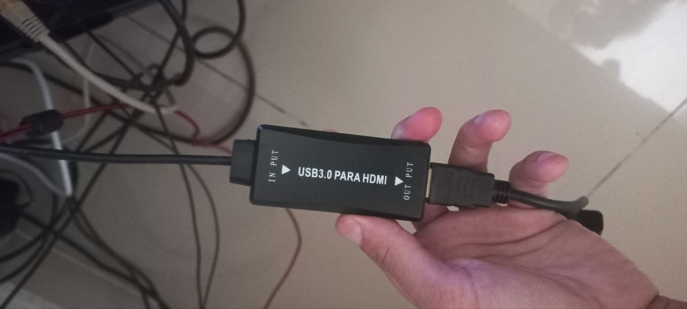
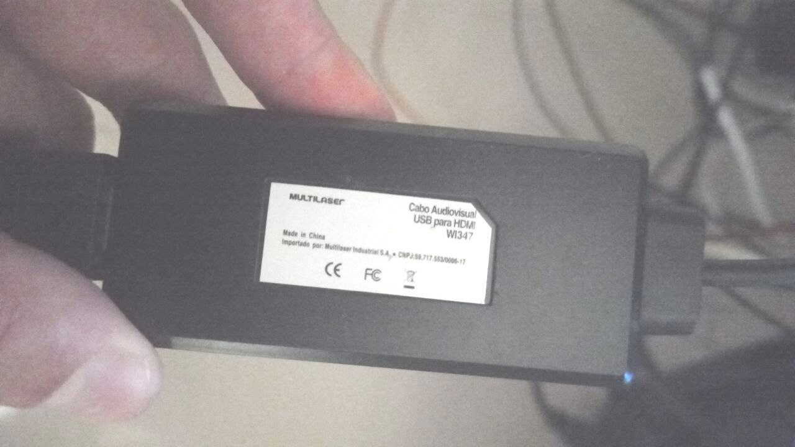
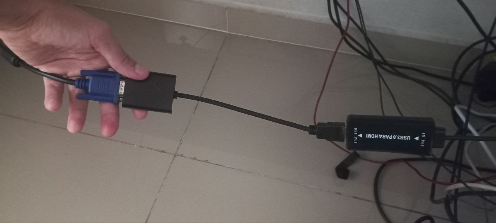
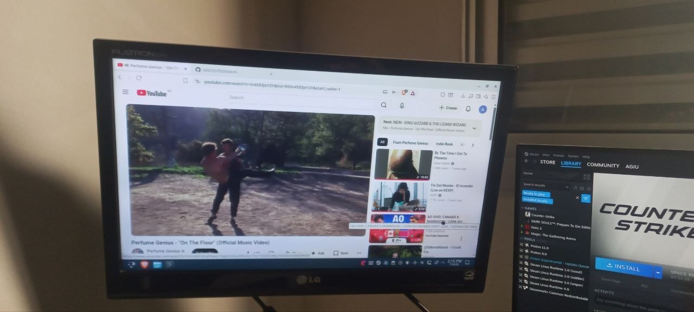

# fl2000drm — Linux DRM driver for Fresco Logic FL2000 USB display adapters

A modern, from-scratch Linux kernel driver for the **Fresco Logic FL2000DX**
USB 3.0 → HDMI/VGA display adapter (USB ID `1d5c:2000`), the chip inside
most of the cheap "USB to HDMI" dongles — sold retail under names like
**Multilaser WI347** ("Cabo Audiovisual USB para HDMI"). The dongle shows
up as a normal KMS/DRM display (`card*`/`HDMI-A-*`): Wayland compositors
and X extend the desktop onto it like any other monitor.

| | |
|:---:|:---:|
|  |  |
| *The dongle: FL2000DX + ITE IT66121 inside* | *Sold as the Multilaser WI347* |
|  |  |
| *Tested through an HDMI→VGA converter into a 1366x768 panel* | *YouTube playing on the FL2000 display at 1360x768@60, driven by this driver* |

## Demo video

[](https://youtu.be/YtxEV64ROw0)

*Click to watch: the FL2000 driving a real desktop, then a close-up of the
dongle itself. → [youtu.be/YtxEV64ROw0](https://youtu.be/YtxEV64ROw0)*

Fresco Logic's official driver targets kernel 3.10 and no longer builds;
this driver was written from scratch for kernel **6.12+**, modeled on the
mainline `gm12u320`/`udl` drivers (simple display pipe, GEM shmem, shadow
planes), using the official GPL reference driver as protocol documentation.

Tested on: Debian 13, kernel 6.12, FL2000DX dongle with ITE IT66121 HDMI
transmitter, KDE Plasma (Wayland) with an NVIDIA primary GPU.

## Features

- Full KMS/DRM device: works out of the box with Wayland (kwin, mutter)
  and X; fbdev console emulation included
- Modes up to 1920x1080@60 on USB 3 links (RGB565 wire format above
  ~320 MB/s, full 24-bit below); 640x480 on USB 2
- EDID over the IT66121 DDC engine (cached; slow DDC never blocks
  compositor ioctls), hotplug detection by polling
- Deep pipelined USB streaming (64 URBs in flight, pre-mapped coherent
  DMA buffers): stable 60 fps that survives CPU load
- Triple-buffered frames: a slow transfer can never stall atomic commits

## Install

```sh
cd driver
make
sudo make install          # modules_install + depmod
# keep udisks from resetting the dongle via its fake "driver CD":
echo 'options usb-storage quirks=1d5c:2000:i' | \
    sudo tee /etc/modprobe.d/fl2000-fakecd.conf
```

Plug the dongle in; the module auto-loads. `drm_shmem_helper` must be
available (it is, on any distro kernel). Optional: DKMS users can use the
included `dkms.conf` so kernel updates rebuild the module automatically.

Module parameter `fmt` (runtime-changeable in
`/sys/module/fl2000drm/parameters/fmt`) forces the wire format:
`0` auto (default), `1` RGB565, `2` RGB888, `3` BGR888 byte order.

## Hardware notes (hard-won — see notes/PROTOCOL.md for the full story)

Two undocumented quirks cost most of the reverse-engineering effort and
are, as far as we know, documented nowhere else:

1. **The bulk pixel stream must have each pair of adjacent 32-bit words
   swapped** (the reference driver's `pixel_swap()`, hidden in its ioctl
   layer). Solid colors are *invariant* under this swap, so color-bar
   tests pass without it — while text turns to confetti.
2. **Register 0x8004 (format latch) must be programmed one bit per
   transfer in the reference driver's exact order** — CCS-reset pulse
   before format bits. Batching the bits into one write corrupts the
   latch; 16 bpp at high modes then stalls the bulk pipe entirely.

Other findings: the fake "driver CD" interface must be ignored or udisks'
CD polling resets the device under load; 1080p60 needs RGB565 (373 MB/s
of RGB888 overruns 5 Gbps and the USB core hard-resets the device);
panels behind HDMI→VGA converters want 1360x768, not 1366.

## Repository layout

- `driver/` — the kernel module (`fl2000drm.ko`)
- `probe/` — userspace Python/pyusb harness: register access, EDID over
  DDC, and a full display bring-up that streams test patterns with no
  kernel driver at all. Invaluable for protocol experiments.
- `notes/PROTOCOL.md` — everything known about the FL2000 USB protocol,
  extracted from the reference driver and validated on hardware

The Fresco Logic GPL reference driver (protocol source of truth) lives at
[FrescoLogic/FL2000](https://github.com/FrescoLogic/FL2000); clone it into
`reference/` if you want to cross-check sequences.

## Known limitations

- 60 Hz modes only (matching the reference driver's bulk-mode tables)
- No audio (the dongle exposes none; HDMI audio via the IT66121 is
  theoretically possible and unimplemented)
- No USB2 compression (USB2 links cap at 640x480)
- Tearing is possible (no vsync-locked page flipping)
- VGA-only FL2000 dongles (no IT66121) are untested

## Credits & license

GPL-2.0. Protocol knowledge derives from Fresco Logic's official GPL
reference driver.

This driver was **entirely vibecoded by Claude Fable 5** (Anthropic) in a
single session — every line of the kernel module, the userspace
reverse-engineering harness, the protocol documentation, and this README.
Adriel Santos supplied the hardware, the eyeballs on the monitor, the
unplug–replug fingers, and the photos. The full journey went from "there
is no Linux driver for this dongle" to the working desktop pictured above:
userspace register probing over EP0, EDID through the IT66121's quirky DDC
engine, first light from Python, then the DRM driver — debugging compositor
freezes, USB device resets caused by a fake driver CD, IOMMU corruption,
a format latch that only accepts one bit at a time, and a 64-bit word swap
documented nowhere on the internet.
